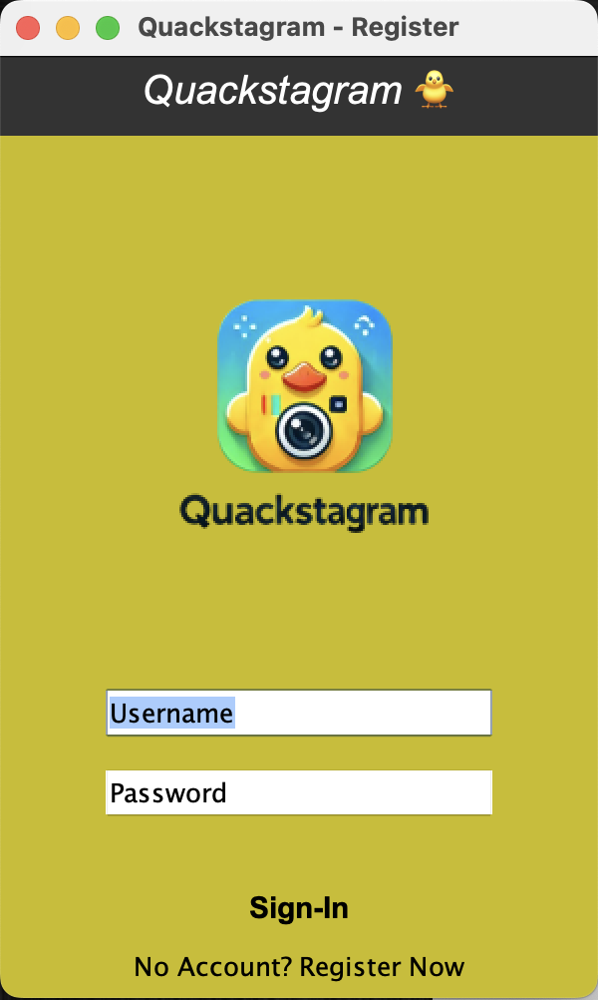

# QuakstagramProject

## Table of Contents

- [Project Overview](#project-overview)
- [Installation](#installation)
- [Database Implementation](#Database)

## Project Overview

Welcome to Quakstagram, a Cheapo software solutions social Media App.


The core of this app revolves around letting users set up and personalize their profiles.
Users sign up, log in, and add a personal touch with photos and bios, just as they
would on Instagram. Once that is done, users can start sharing snapshots of their lives
by uploading images with captions.

## Installation

### Step 1: Clone the repository

Clone the Quackstagram repository from GitHub to your local machine:

```bash
git clone https://github.com/vessahnjoya/QuackstagramProject.git
```

Then Navigate to the project's Location

```bash
cd QuackstagramProject
```

### Step 2: Compile and Run the Main Application

open the folder `App`

Open the file `Main.java`, and click on run OR type the following inside your terminal

```bash
javac Main.java
java Main
```

## Database
Schema, Views and Triggers can be found under the DATABASE folder.

The database was implemented in these following classes:

### 1: DatabaseConnection
This is the main class where the databaseconnection is created.

### 2: Credentials Verifier
In this class the database was used to verify user credentials upon login, and to get user Bio.

### 3: SignUpCredentials
In this class the database was used to save new user information into the users table, and to verify if the username entered by the new user already exists in the users table.

### 4: ImageUploadUI
In this class the db is used to save the post infor such as image_path, caption, user_id and timestamp.

### 5: InstagramProfileUi
In this class the user is used to get following, followers, and posts counts, Bio, and profile image. Note that here we did not handleFollowAction Action to save time

### 6: DirectMessagingUI
In this class the database is used to send and retrieve chat history between users

### 7: QuackstagramHomeUI
IOn this class the database is implemented to retrieve followed users post with all their data

### 8: CommentsUI
In this class the database is used to save, load comments. However not functional :)

### 9: EditPorifleUI
Here the database is used to update user's bio

### 10: Like Functionality
Herze the database is used to like user's posts

### 11: ExploreUI
Here the database is used to retrieve all exisiting pots to populate the discovery/explore page

### 12: NotificationsUI
Here the database is used to display recents notifications recieved by a user
